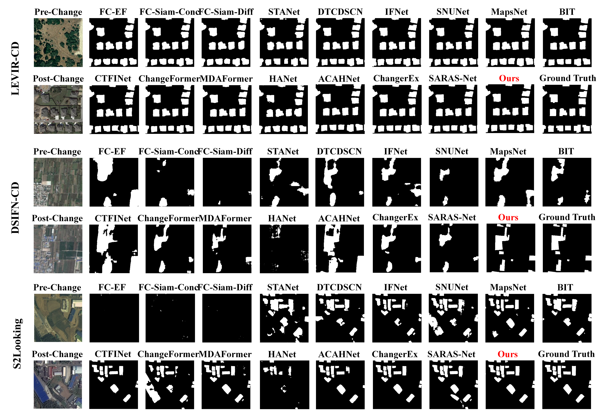

# PRX-Change: Enhancing Remote Sensing Change Detection through Progressive Feature Refinement and Cross-Attention Interaction

## :speech_balloon: Network Architecture


 ## :speech_balloon: Qualitative Results on LEVIR-CD, DSIFN-CD and S2Looking

[//]: # (![image-QuantitativeResult]&#40;Images/image-20221117160727181.png&#41;)



## :speech_balloon: Requirements

```
Python==3.8
PyTorch==1.12
torchvision==0.13
apex==0.01
```

Please see `requirements.txt` for all the other requirements.

You can create a virtual `conda` environment with the following command:

```bash
conda create -n {env_name} -f {path_of_requirements.txt}
conda activate {env_name}
```

## :speech_balloon: Installation

Clone this repository:

```bash
git clone [https://github.com/RSChangeDetection/X-Cross.git](https://github.com/Touriate/PRX-Change-main.git)
cd PRX-Change-main
```

## :speech_balloon: Download Dataset

You can download the datasets at the link below:

`LEVIR-CD`: [`click here to download`](https://justchenhao.github.io/LEVIR/)

`DSIFN-CD`:  [`click here to download`](https://github.com/GeoZcx/A-deeply-supervised-image-fusion-network-for-change-detection-in-remote-sensing-images/tree/master/dataset)

`S2Looking`: [`click here to download`](https://github.com/S2Looking/Dataset)

You can also download the pre-processed datasets at the link below for training:

`LEVIR-CD-256`: [`click here to download`](https://www.dropbox.com/sh/lnjxpflvgjijwoj/AAAgWr3xgOjqtTWPVpbLVcfNa?dl=0)

`DSIFN-CD-256`: [`click here to download`](https://www.dropbox.com/sh/i54h8kkpgar1s07/AACK5_jLGS3cP9ocgOMEUJcNa?dl=0)

**PS**: The downloaded dataset's organization differs from ours, thus you cannot conduct the training procedure directly with it. Please refer to [Dataset Preparation](#jump). 

## :speech_balloon: Quick Start

Our PRX-Change pre-trained model weights are available at  [`Baidu Driver`](https://pan.baidu.com/s/1I6t6RFCV78xPAMG_-h0Jzw?pwd=jrxl). 

After downloading the pre-trained model weights, you should put them in /checkpoints.

We have some samples from [`LEVIR-CD`](https://justchenhao.github.io/LEVIR/) dataset in `test_samples` for a quick start. 

You can find the evaluation script file `quick_start.sh` in the folder `test_script`. You can run the bash file in terminal to test the samples we provided:

```bash
bash quick_start.sh
```

After that, you can find the detection results in `results/qs/`

 ## :speech_balloon: Evaluate on LEVIR, DSIFN and S2Looking

In order to evaluate on the above datasets, you need to first download the relevant datasets

Then, organize them in the corresponding directory of the `/data` according to [Dataset Preparation](#jump). 

Then, start with running following scripts in `/test_script`:

```bash
bash test_levir.sh
bash test_dsifn.sh
bash test_s2looking.sh
```

After that, you can find the detection results in `results/*/`

## :speech_balloon: Training

We initialize the parameters of model's backbone with model pre-trained on ImageNet,  $i.e.$ $ResNets$.

You can download the pre-trained model  here: [`ResNet 18`](https://download.pytorch.org/models/resnet18-f37072fd.pth)

Then, put the weight in `checkpoints/base/`

You can find the training script `train_*.sh`, `train_refine_*.sh` in the folder `train_script`. You can run the script file in terminal.

For datasets `*` in `LEVIR-CD, DSIFN-CD, S2Looking` You can obtain the most ideal training results by following these steps:

```bash
# set save_path='your path'
bash train_*.sh # get 1.pth

# set save_path='your path' checkpoint_path='1.pth' in train_refine_*.sh'
bash train_refine_*.sh # get 2.pth

# set checkpoint_path='2.pth' cross=True
bash train_refine_*.sh # get best.pth
```

## :speech_balloon: <span id="jump">Dataset Preparation</span>

### :point_right: Data Structure

```
"""
Datasets of Change Detection
├————train
|      ├———A  
|      ├———B
|      ├———label
|
├————val
|      ├————...
|
├————test
|      ├————...
"""
```

Your dataset are wished to be like this, and you can turn the organization to this according to label file  `**.txt` in `list` , **or** you can modify `change_dataloader.py` in `change` and `train.py`  to adapt to your datasets organization style.

`A` means the directory of pre-changed images

`B` means the directory post-changed images

`label` means the directory of change masks

## :speech_balloon: License

Code is released for non-commercial and research purposes **only**. For commercial purposes, please contact the authors.
